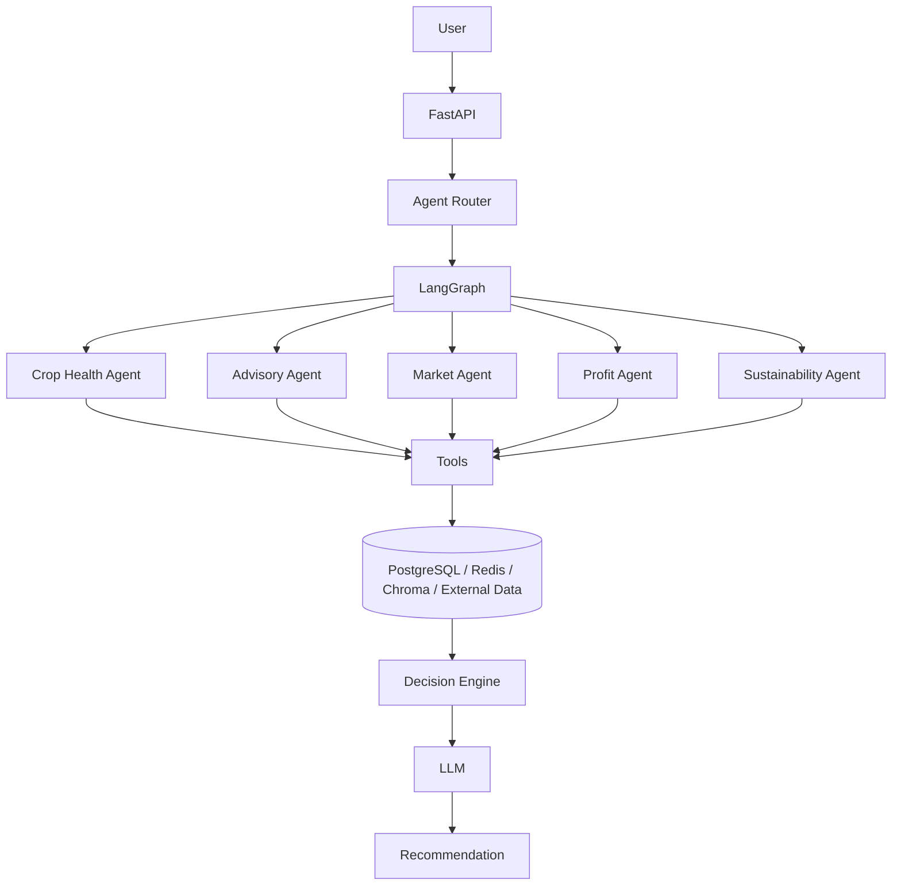

# FarmMind

FarmMind is a production-style MVP for agricultural decision support. It combines a FastAPI backend, LangGraph orchestration, specialized farming agents, and deterministic recommendation logic to help farmers evaluate crop health, market conditions, profitability, and sustainability.

## Problem Statement

Farmers need a unified system that can summarize crop condition, suggest immediate action, compare market timing, estimate profit, and evaluate sustainability. Most solutions are fragmented across spreadsheets, weather apps, and manual notes. FarmMind brings these signals together in one system.

## Solution

The platform routes user queries through a LangGraph workflow, runs the required agents, and then combines their outputs using a deterministic scoring engine. The final response is generated by an LLM but depends on real tool-based calculations instead of pure freeform reasoning.

## Architecture



## Tech Stack

- Python 3.11+
- FastAPI
- LangChain
- LangGraph
- Pydantic
- SQLAlchemy
- PostgreSQL
- Redis
- Chroma
- Pandas
- Docker Compose

## Multi-Agent Workflow

The app routes user queries to the minimal required set of agents:

- Crop Health Agent: assess field symptoms and identify potential issues
- Advisory Agent: translate findings into practical actions
- Market Agent: review price trend and selling opportunity
- Profit Agent: calculate revenue, cost, and ROI
- Sustainability Agent: evaluate climate and resource efficiency

## Project Structure

```text
farmmind/
  app/
    agents/
    api/
    core/
    db/
    decision/
    graph/
    llm/
    schemas/
    services/
    tools/
    utils/
  tests/
  data/
  docker/
  .env.example
  docker-compose.yml
  requirements.txt
  README.md
  run.py
```

## Agent Descriptions

### Crop Health Agent
Analyzes crop symptoms, field moisture, and temperature to estimate a crop health score and likely issues.

### Advisory Agent
Converts health findings into actionable recommendations without giving unsafe dosage instructions.

### Market Agent
Compares current and historical crop prices using mock data and assigns a selling recommendation.

### Profit Agent
Calculates revenue, total cost, profit, and ROI from yield and cost inputs.

### Sustainability Agent
Assesses water, fertilizer, soil quality, and resource efficiency based on farm conditions.

## API Endpoints

- GET /health
- POST /api/v1/chat
- POST /api/v1/farm/analyze
- POST /api/v1/knowledge/ingest
- POST /api/v1/knowledge/search

## Setup Instructions

1. Open a terminal in the project root.
2. Copy the sample environment file:
   `copy .env.example .env`
3. Install dependencies:
   `pip install -r requirements.txt`
4. Start the application:
   `python run.py`
5. Open the docs at http://localhost:8000/docs

## Environment Variables

See .env.example for the required variables.

## Docker Instructions

```bash
docker compose up --build
```

The API will be available at http://localhost:8000.

## Example API Requests

### Chat

```bash
curl -X POST http://localhost:8000/api/v1/chat \
  -H "Content-Type: application/json" \
  -d '{
    "query": "Should I sell my rice now?",
    "farmer": {"name": "Demo Farmer", "location": "Odisha", "farm_size_acres": 5},
    "crop": {"name": "Rice", "expected_yield_quintals": 50}
  }'
```

### Farm Analysis

```bash
curl -X POST http://localhost:8000/api/v1/farm/analyze \
  -H "Content-Type: application/json" \
  -d '{
    "query": "Give me a complete analysis of my farm.",
    "farmer": {"name": "Demo Farmer", "location": "Odisha", "farm_size_acres": 5},
    "crop": {"name": "Rice", "expected_yield_quintals": 50}
  }'
```

## Example Responses

```json
{
  "request_id": "uuid",
  "query": "Should I sell my rice now?",
  "agents_used": ["market", "profit"],
  "analysis": {
    "market": {"crop": "Rice", "trend": "Increasing"},
    "profit": {"estimated_profit": 53000.0}
  },
  "recommendation": {
    "overall_score": 81,
    "risk_level": "Low"
  },
  "final_answer": "The market is favorable and projected profit remains positive."
}
```

## Testing Instructions

```bash
pytest -q
```

## Future Improvements

- Real-time sensor integration
- Better LLM routing with actual structured responses
- Real market price APIs
- Weather-based recommendations
- User authentication and dashboards

## Disclaimer

This project provides decision support and mock agricultural data. It is not a substitute for agronomy professional advice.
